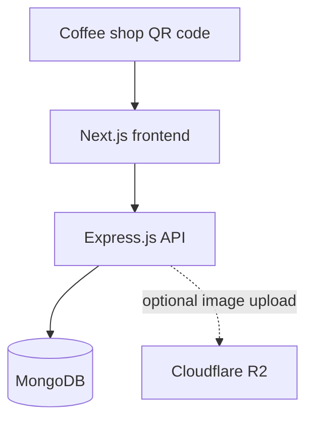

# MENU SCAN Backend

MENU SCAN is a multi-coffee-shop digital menu platform. A customer scans a
coffee shop's QR code, the Next.js frontend resolves the shop's public slug,
and this Express API returns the menu data stored in MongoDB. Coffee-shop
operators manage their own menu from the backoffice, while an application
administrator manages all coffee shops.

This document is the implementation reference for the backend. It describes
the routes, data model, authorization boundaries, local workflow, and
extension points that exist in this repository.

## Contents

- [Architecture](#architecture)
- [Technology stack](#technology-stack)
- [Project structure](#project-structure)
- [Request lifecycle](#request-lifecycle)
- [Database](#database)
- [Running locally](#running-locally)
- [Environment configuration](#environment-configuration)
- [Seed data and migrations](#seed-data-and-migrations)
- [API conventions](#api-conventions)
- [Public menu API](#public-menu-api)
- [Admin API](#admin-api)
- [PIN security and authorization](#pin-security-and-authorization)
- [Images](#images)
- [Errors](#errors)
- [Security posture and known limitations](#security-posture-and-known-limitations)
- [Testing](#testing)
- [Deployment](#deployment)
- [Development guidelines](#development-guidelines)
- [Architecture decisions](#architecture-decisions)
- [Quick reference](#quick-reference)

## Architecture



The QR code identifies a coffee shop, normally by a public slug such as
`cafe-el-manzah`. The QR code does not contain private credentials. The
frontend calls the public API and renders the returned menu.

There are two backoffice experiences:

```text
Application administrator
    └── all coffees

Coffee administrator
    └── one assigned coffee
        ├── coffee profile
        ├── categories
        └── items
```

The menu hierarchy is:

```text
Coffee
└── ItemCategory
    └── Item
```

The backend is intentionally split into an application factory (`src/app.ts`)
and a process entry point (`src/server.ts`). The factory is side-effect free
and is used by the test suite; the server entry point connects to MongoDB,
starts listening, and performs graceful shutdown.

## Technology stack

| Technology | Version/source | Role |
| --- | --- | --- |
| Node.js | `22.x` | Runtime |
| TypeScript | `^7.0.2` | Static typing and compilation |
| Express | `^5.2.1` | HTTP server and middleware pipeline |
| MongoDB | Server/runtime dependency | Document database |
| Mongoose | `^9.10.0` | Models, queries, document validation |
| Zod | `^4.6.3` | Request and environment validation |
| JSON Web Token | `jsonwebtoken ^9.0.3` | Short-lived admin bearer tokens |
| Node `crypto.scrypt` | Built into Node.js | One-way hashing of coffee PINs |
| Helmet | `^8.3.0` | Security-related HTTP headers |
| CORS | `^2.8.6` | Frontend-origin restrictions |
| Multer | `^2.3.0` | In-memory multipart image uploads |
| Pino / pino-http | `^10.3.1` / `^11.0.0` | Structured application/request logging |
| Vitest | `^5.0.0` | Test runner |
| Supertest | `^7.2.2` | HTTP-level API tests |
| mongodb-memory-server | `^11.2.0` | Isolated MongoDB test server |
| Cloudflare R2 | External optional service | Image binary storage and delivery |

The package is ESM (`"type": "module"`). Compiled output is written to
`dist/`.

## Project structure

```text
.
├── src/
│   ├── app.ts
│   ├── server.ts
│   ├── auth/
│   ├── config/
│   ├── controllers/
│   ├── db/
│   │   ├── migrations/
│   │   ├── migrate.ts
│   │   └── seed.ts
│   ├── middlewares/
│   ├── models/
│   ├── repositories/
│   ├── routes/
│   ├── services/
│   ├── types/
│   ├── utils/
│   └── validators/
├── tests/
├── .env.example
├── package.json
├── ROUTES.md
├── tsconfig.json
├── tsconfig.build.json
└── vitest.config.ts
```

| Directory/file | Responsibility | Keep out of it |
| --- | --- | --- |
| `src/app.ts` | Composes Express middleware and routers without opening sockets or databases. | Business logic and process startup |
| `src/server.ts` | Connects to MongoDB, starts the HTTP listener, and handles shutdown. | Route definitions |
| `src/config/` | Parses environment variables and builds CORS configuration. | Request-specific state |
| `src/routes/` | Maps HTTP methods/paths to middleware and controllers. | Database queries and business rules |
| `src/controllers/` | Reads validated request data, calls services, and serializes success responses. | Authorization policy or raw MongoDB access |
| `src/services/` | Business rules, ownership checks, orchestration, and DTO construction. | Express route registration |
| `src/repositories/` | Mongoose data access and ownership-scoped queries. | HTTP status handling |
| `src/models/` | Mongoose schemas, collection names, indexes, and model types. | Controller behavior |
| `src/middlewares/` | Validation, authentication, uploads, 404 handling, and centralized errors. | Entity-specific business operations |
| `src/validators/` | Zod schemas for params and JSON bodies. | Persistence |
| `src/auth/` | PIN hashing/comparison and JWT issue/verification. | Route-specific CRUD |
| `src/db/` | Connection helpers, ordered migrations, and development seed data. | Runtime request handling |
| `src/types/` | API DTOs and shared request/auth types. | Mongoose schema definitions |
| `src/utils/` | Shared errors, response envelopes, and logging. | Domain-specific workflows |
| `tests/` | API, admin authorization, and image behavior tests. | Production code |

`ROUTES.md` is a compact route list. This README is the authoritative
high-level architecture and integration guide.

## Request lifecycle

```text
HTTP request
    ↓
Express app middleware
    ├── Helmet
    ├── CORS
    ├── JSON parser (10 KB limit)
    └── Pino request logger
    ↓
Versioned route
    ↓
Zod validation (where the route has input)
    ↓
Bearer authentication and role middleware (admin routes)
    ↓
Controller
    ↓
Service
    ↓
Repository / Mongoose model
    ↓
MongoDB
    ↓
{ success: true, data: ... }
```

- **Validation** occurs in `validate.middleware.ts` before controller logic.
- **Authentication** verifies the `Authorization: Bearer <token>` header.
- **Authorization** checks `APP_ADMIN` or `COFFEE_ADMIN` and, for coffee
  admins, the coffee ID embedded in the verified token.
- **Business logic** belongs in services.
- **Database access** belongs in repositories or migration/seed code.
- **Errors** flow to the final centralized error middleware and are returned
  in a consistent envelope.

This separation keeps HTTP behavior testable and prevents controllers from
quietly bypassing tenant ownership rules.

## Database

### Collections and relationships

```text
coffees
  └── itemcategories.coffeeId
        └── items.itemCategoryId
```

#### `coffees`

| Field | Type | Rules |
| --- | --- | --- |
| `_id` | `ObjectId` | MongoDB identifier |
| `name` | string | Required, trimmed, max 120 characters |
| `slug` | string | Required, lowercase slug, max 80, unique |
| `logo` | string | Required URL in API input |
| `logoImageId` | string or `null` | Cloudflare R2 object key when managed; absent/null for external URLs |
| `cover` | string or `null` | Optional public cover image URL |
| `coverImageId` | string or `null` | Cloudflare R2 object key backing `cover` when managed |
| `adminPinHash` | string | `select: false`; scrypt hash, never returned |
| `createdAt`, `updatedAt` | date | Mongoose timestamps |

#### `itemcategories`

| Field | Type | Rules |
| --- | --- | --- |
| `_id` | `ObjectId` | MongoDB identifier |
| `name` | string | Required, trimmed, max 80 characters |
| `coffeeId` | `ObjectId` | Required reference to `coffees._id` |
| `createdAt`, `updatedAt` | date | Mongoose timestamps |

Categories are unique by `(coffeeId, name)`, not globally. Two coffees can
both have a category named `Cafés`.

#### `items`

| Field | Type | Rules |
| --- | --- | --- |
| `_id` | `ObjectId` | MongoDB identifier |
| `name` | string | Required, trimmed, max 120 characters |
| `description` | string or `null` | Optional, max 500 characters |
| `price` | number | Required, finite, zero or greater |
| `image` | string or `null` | Optional URL |
| `imageId` | string or `null` | Cloudflare R2 object key when managed |
| `itemCategoryId` | `ObjectId` | Required reference to `itemcategories._id` |
| `createdAt`, `updatedAt` | date | Mongoose timestamps |

#### `images`

The optional image integration stores metadata only:

| Field | Type | Rules |
| --- | --- | --- |
| `imageId` | string | Required and unique Cloudflare ID |
| `url` | string | Required public delivery URL |
| `filename` | string or `null` | Sanitized original filename |
| `alt` | string or `null` | Optional metadata field |
| `ownerType` | `COFFEE` or `APP` | Ownership boundary |
| `coffeeId` | `ObjectId` or `null` | Owning coffee for coffee-owned images |
| `uploadedByRole` | `APP_ADMIN` or `COFFEE_ADMIN` | Uploading role |

No image binary is stored in MongoDB or on the local filesystem.

### Indexes and constraints

- `coffees.slug`: unique index (`uq_coffees_slug`).
- `itemcategories.(coffeeId, name)`: unique compound index
  (`uq_itemcategories_coffee_name`).
- `itemcategories.coffeeId`: lookup index.
- `items.itemCategoryId`: lookup index.
- `images.imageId`: unique index.
- `images.coffeeId`: lookup index.

Mongoose schema validation and MongoDB `$jsonSchema` validators both protect
the data. Indexes are managed by migrations; the runtime connection disables
Mongoose `autoIndex`.

### Ownership resolution

An item does not store `coffeeId` directly. The service resolves ownership by
walking the relationship:

```text
Item
 ↓ itemCategoryId
ItemCategory
 ↓ coffeeId
Coffee
```

Coffee-admin repository methods include the authenticated coffee ID in their
queries or verify it through this chain. A valid item ID alone is never enough
to edit another coffee's item.

### Deletion behavior

- Deleting a coffee deletes its items, categories, and coffee document in
  dependency order. Managed Cloudflare images are also cleaned up.
- Deleting a category deletes its items and their managed images.
- Deleting an item deletes its managed image.
- Replacing a managed logo or item image cleans up the previous managed image.
- External URLs are retained as URLs and are not sent to Cloudflare for
  deletion.

These are application-level cascades; MongoDB foreign-key cascades are not
used.

## Running locally

### Prerequisites

- Node.js 22.x
- npm
- A reachable MongoDB instance, local or hosted

### Install and configure

```bash
git clone <repository-url>
cd backend
npm install
copy .env.example .env
```

On macOS/Linux, use `cp .env.example .env` instead of `copy`.

Edit `.env` with a local MongoDB URL and a frontend origin. The checked-in
`.env.example` contains safe development placeholders; never commit a real
`.env`.

### Initialize the database

```bash
npm run db:migrate
npm run db:seed
```

`db:migrate` is idempotent. It records applied migrations in the `_migrations`
collection and runs each migration once. `db:seed` is intentionally
destructive: it removes existing coffees, categories, and items before
recreating the development dataset.

### Start the API

```bash
npm run dev
```

The default local server is `http://localhost:4000`.

Useful checks:

```bash
curl http://localhost:4000/
curl http://localhost:4000/health
curl http://localhost:4000/health/ready
curl http://localhost:4000/api/v1/coffees/cafe-el-manzah
```

### Production build

```bash
npm run typecheck
npm run build
npm start
```

`npm start` runs `dist/server.js`; the production process still needs the
environment variables described below and a reachable MongoDB database.

## Environment configuration

`.env.example` is the template for all supported variables.

| Variable | Required | Description |
| --- | --- | --- |
| `NODE_ENV` | No | `development`, `test`, or `production`; defaults to `development` |
| `HOST` | No | Bind host; defaults to `0.0.0.0` |
| `PORT` | No | Positive TCP port; defaults to `4000` |
| `DATABASE_URL` | Yes in practice | MongoDB connection string; local default is `mongodb://127.0.0.1:27017/menuscan` |
| `FRONTEND_URL` | No | Primary allowed Next.js origin; defaults to `http://localhost:3000` |
| `CORS_ORIGINS` | No | Comma-separated additional origins; `*` is rejected in production |
| `LOG_LEVEL` | No | Pino level such as `info`, `warn`, or `silent` |
| `APP_ADMIN_PIN` | No | Exactly four digits for app-admin login; development default is `3219` |
| `ADMIN_SECRET` | Yes in production | HS256 signing secret, minimum 16 characters; the development default is rejected in production |
| `ADMIN_TOKEN_TTL` | No | JWT lifetime, for example `12h` or `1d`; defaults to `12h` |
| `CLOUDFLARE_ACCOUNT_ID` | Only for image uploads | Cloudflare account ID |
| `CLOUDFLARE_R2_ACCESS_KEY_ID` | Only for image uploads | Server-side R2 access key |
| `CLOUDFLARE_R2_SECRET_ACCESS_KEY` | Only for image uploads | Server-side R2 secret |
| `CLOUDFLARE_R2_BUCKET_NAME` | Only for image uploads | R2 bucket name |
| `CLOUDFLARE_R2_ENDPOINT` | Only for image uploads | Account-specific R2 S3 endpoint |
| `CLOUDFLARE_R2_PUBLIC_URL` | Needed for delivery URLs | Public custom domain or public bucket URL |

The application validates environment variables at startup and exits before
listening if configuration is invalid. Cloudflare variables are optional:
without them, image upload endpoints return `503`.

## Seed data and migrations

The seed creates three intentionally different coffees:

- `cafe-el-manzah`
- `brew-and-beans`
- `coffee-leaf`

Each coffee receives its own categories and items. Some category names are
intentionally repeated across coffees to exercise tenant isolation. Seeded
coffee-admin PINs are hashed from the development PIN `0000`.

Do not run the seed against a production database. It deletes the menu data
before recreating it.

Migrations are ordered in `src/db/migrations/` and tracked in `_migrations`.
Never rename or reorder an already-applied migration. Add a new migration at
the end of the migration list and keep destructive rollback behavior explicit.

## API conventions

### Base URL and versioning

Local base URL:

```text
http://localhost:4000
```

All application endpoints are under `/api/v1`. System endpoints are mounted
at `/` and `/health`.

### Success envelope

```json
{
  "success": true,
  "data": {}
}
```

Create operations return `201`; ordinary successful reads and updates return
`200`.

### Authentication header

Admin endpoints use:

```http
Authorization: Bearer <jwt>
```

Tokens are returned by the admin login endpoints and are not stored in a
server-side session.

### IDs and validation

- MongoDB IDs must be 24-character hexadecimal ObjectIds.
- Coffee slugs are lowercase and match `[a-z0-9]+(?:-[a-z0-9]+)*`.
- PINs are exactly four decimal digits.
- PATCH bodies must contain at least one editable field.
- URL fields are validated as URLs.
- JSON request bodies are limited to 10 KB.

## Public menu API

Public routes require no authentication. They are designed for the QR menu
flow.

### Resolve a coffee by slug

```http
GET /api/v1/coffees/:coffeeSlug
```

Returns one coffee and only its categories. Categories are sorted by name.

Example:

```bash
curl http://localhost:4000/api/v1/coffees/cafe-el-manzah
```

Response:

```json
{
  "success": true,
  "data": {
    "id": "64f000000000000000000001",
    "name": "Café El Manzah",
    "logo": "https://example.com/logo.png",
    "slug": "cafe-el-manzah",
    "categories": [
      {
        "id": "64f000000000000000000010",
        "name": "Cafés"
      }
    ]
  }
}
```

Errors include `400` for an invalid slug and `404` for an unknown coffee.

### List items in a category

```http
GET /api/v1/categories/:categoryId/items
```

Returns only the items whose `itemCategoryId` is the requested category.
Items are sorted by name.

```bash
curl http://localhost:4000/api/v1/categories/64f000000000000000000010/items
```

Response:

```json
{
  "success": true,
  "data": [
    {
      "id": "64f000000000000000000020",
      "name": "Espresso",
      "description": "Café espresso traditionnel",
      "price": 2.5,
      "image": "https://example.com/espresso.jpg"
    }
  ]
}
```

Errors include `400` for an invalid ObjectId and `404` when the category does
not exist.

## Admin API

Admin routes are mounted under `/api/v1/admin`.

### Authentication

#### Application admin login

```http
POST /api/v1/admin/auth/app
Content-Type: application/json
```

Body:

```json
{ "pin": "<APP_ADMIN_PIN>" }
```

Success:

```json
{
  "success": true,
  "data": {
    "token": "<jwt>",
    "role": "APP_ADMIN",
    "expiresIn": "12h"
  }
}
```

The PIN is compared against `APP_ADMIN_PIN` using a constant-time comparison.
Wrong or malformed PINs return `401`.

#### Coffee admin login

```http
POST /api/v1/admin/auth/coffee/:coffeeSlug
Content-Type: application/json
```

Body:

```json
{ "pin": "0000" }
```

Success:

```json
{
  "success": true,
  "data": {
    "token": "<jwt>",
    "role": "COFFEE_ADMIN",
    "coffeeId": "64f000000000000000000001",
    "expiresIn": "12h"
  }
}
```

New and seeded coffees use `0000` as the initial PIN. The stored value is a
scrypt hash, not plaintext.

### Application admin

Every route in this section requires a valid bearer token whose role is
`APP_ADMIN`.

| Method | Endpoint | Body | Purpose |
| --- | --- | --- | --- |
| `GET` | `/api/v1/admin/coffees` | — | List all coffees with `categoryCount` |
| `POST` | `/api/v1/admin/coffees` | `{ name, logo, cover?, slug? }` | Create a coffee; generated/default PIN is `0000` |
| `GET` | `/api/v1/admin/coffees/:coffeeId` | — | Get one coffee |
| `PATCH` | `/api/v1/admin/coffees/:coffeeId` | `{ name?, logo?, cover?, slug? }` | Update a coffee |
| `PATCH` | `/api/v1/admin/coffees/:coffeeId/pin` | — | Reset its PIN to `0000` |
| `DELETE` | `/api/v1/admin/coffees/:coffeeId` | — | Delete coffee and dependent categories/items |

Example create:

```bash
curl -X POST http://localhost:4000/api/v1/admin/coffees ^
  -H "Authorization: Bearer <APP_ADMIN_TOKEN>" ^
  -H "Content-Type: application/json" ^
  -d "{\"name\":\"Café Ternat\",\"logo\":\"https://example.com/logo.png\"}"
```

`slug` is optional. When omitted, it is generated from the name and made
unique, for example `Café Ternat` becomes `cafe-ternat`. A requested slug
that is already used returns `409`.

Application-admin coffee DTO:

```json
{
  "id": "64f000000000000000000001",
  "name": "Café Ternat",
  "logo": "https://example.com/logo.png",
  "slug": "cafe-ternat",
  "categoryCount": 0,
  "createdAt": "2026-01-01T12:00:00.000Z",
  "updatedAt": "2026-01-01T12:00:00.000Z"
}
```

### Coffee admin

Every route in this section requires a valid bearer token whose role is
`COFFEE_ADMIN`. The token identifies exactly one coffee; there is no
`coffeeId` request parameter on these routes.

| Method | Endpoint | Body | Purpose |
| --- | --- | --- | --- |
| `GET` | `/api/v1/admin/my-coffee` | — | Read the assigned coffee |
| `PATCH` | `/api/v1/admin/my-coffee` | `{ name?, logo?, cover?, slug? }` | Update the assigned coffee |
| `PATCH` | `/api/v1/admin/my-coffee/pin` | `{ currentPin, newPin }` | Change the assigned coffee PIN |
| `GET` | `/api/v1/admin/my-coffee/categories` | — | List assigned coffee categories |
| `POST` | `/api/v1/admin/my-coffee/categories` | `{ name, image? }` | Create a category with an optional image |
| `PATCH` | `/api/v1/admin/my-coffee/categories/:categoryId` | `{ name, image? }` | Update an owned category and optional image |
| `DELETE` | `/api/v1/admin/my-coffee/categories/:categoryId` | — | Delete category and its items |
| `GET` | `/api/v1/admin/my-coffee/categories/:categoryId/items` | — | List items in an owned category |
| `POST` | `/api/v1/admin/my-coffee/categories/:categoryId/items` | `{ name, price, description?, image? }` | Create an item |
| `PATCH` | `/api/v1/admin/my-coffee/items/:itemId` | `{ name?, price?, description?, image? }` | Update an owned item |
| `DELETE` | `/api/v1/admin/my-coffee/items/:itemId` | — | Delete an owned item |

Category example:

```http
POST /api/v1/admin/my-coffee/categories
Authorization: Bearer <COFFEE_ADMIN_TOKEN>
Content-Type: application/json

{ "name": "Snacks" }
```

Item example:

```http
POST /api/v1/admin/my-coffee/categories/64f000000000000000000010/items
Authorization: Bearer <COFFEE_ADMIN_TOKEN>
Content-Type: application/json

{
  "name": "Croissant",
  "description": "Feuilleté pur beurre",
  "price": 2,
  "image": "https://example.com/croissant.jpg"
}
```

Coffee-admin item responses include `itemCategoryId`, `createdAt`, and
`updatedAt`. A coffee admin supplying another coffee's category or item ID
receives `404` and no data is modified.

## PIN security and authorization

This is an MVP lightweight access-control mechanism, not a complete enterprise
identity system.

### Storage and verification

- The application-admin PIN comes from `APP_ADMIN_PIN`. It is not stored in
  MongoDB and is compared in constant time.
- Each coffee has a four-digit PIN. New and reset coffee PINs default to
  `0000`.
- Coffee PINs are stored as `scrypt$<base64 salt>$<base64 derived key>`.
- PIN verification derives a key with the stored salt and uses
  `timingSafeEqual`.
- Plain PINs are never returned in API responses.

### Sessions/tokens

Successful login issues a short-lived JWT signed with `ADMIN_SECRET`, using
HS256 and issuer `menuscan-backend`. The token contains:

```json
{ "role": "APP_ADMIN" }
```

or:

```json
{ "role": "COFFEE_ADMIN", "coffeeId": "<owned coffee id>" }
```

The lifetime is controlled by `ADMIN_TOKEN_TTL`. The server does not persist
sessions; clients must send the bearer token on each admin request.

### Authorization boundary

```text
APP_ADMIN
    ↓
all coffees, categories, items, and images

COFFEE_ADMIN
    ↓
only the coffeeId in its verified token
```

Ownership is enforced in repositories and services, not merely by frontend
route conventions. For example:

- A coffee admin can update its own category.
- A coffee admin cannot update a category belonging to another coffee, even
  when it knows the other category's ObjectId.
- A coffee admin cannot update an item from another coffee because the
  backend walks `item → itemCategory → coffee`.
- An app admin can list, create, update, reset, and delete any coffee.
- Image deletion is also ownership checked; app admins can manage any image,
  while coffee admins can manage only images owned by their coffee.

### PIN operations

- App admin reset: `PATCH /api/v1/admin/coffees/:coffeeId/pin` sets the target
  coffee PIN to hashed `0000`.
- Coffee admin change: `PATCH /api/v1/admin/my-coffee/pin` requires
  `currentPin` and a different four-digit `newPin`.
- Changing a coffee PIN does not revoke already-issued JWTs; tokens expire
  according to `ADMIN_TOKEN_TTL`.

For production, replace this MVP gate with a full identity provider,
per-user accounts, rate limiting, audit events, and token/session revocation.

## Images

Image routes are available to both admin roles:

| Method | Endpoint | Content type | Purpose |
| --- | --- | --- | --- |
| `POST` | `/api/v1/admin/images` | `multipart/form-data`, field `file` | Upload an image |
| `DELETE` | `/api/v1/admin/images/:imageId` | — | Delete a managed image |

Uploads are held in memory and sent to Cloudflare R2. Accepted formats
are JPEG, PNG, WebP, and GIF, with a configurable maximum size of 25 MB by
default (`IMAGE_UPLOAD_MAX_MB`, bounded to 100 MB). The backend checks
the MIME type, file signature/magic bytes, and extension before upload.

Successful upload:

```json
{
  "success": true,
  "data": {
    "imageId": "<cloudflare-image-id>",
    "url": "https://cdn.example.com/uploads/2026-09-14/<uuid>.webp"
  }
}
```

The returned URL may be supplied as a coffee `logo`, coffee `cover`, or item `image`. When it
is a managed Cloudflare delivery URL, the backend records the image ID and
can clean it up when the owning entity is replaced or deleted. If Cloudflare
is not configured, upload/delete operations that require it return `503`.

## Errors

All API errors use:

```json
{
  "success": false,
  "message": "Validation failed",
  "details": [
    { "field": "body.price", "message": "Item price must be zero or greater." }
  ]
}
```

Typical status codes:

| Status | Meaning |
| --- | --- |
| `400` | Invalid input, malformed JSON, invalid identifier, or unsupported image |
| `401` | Missing/invalid/expired bearer token or incorrect PIN |
| `403` | Wrong admin role, cross-coffee image ownership violation, or CORS denial |
| `404` | Unknown route, coffee, category, item, or image |
| `409` | Duplicate slug, duplicate category name, or MongoDB duplicate key |
| `413` | JSON body or image exceeds the configured limit |
| `500` | Unexpected server-side failure; details are logged, not exposed |
| `502` | Cloudflare R2 request failed |
| `503` | Database readiness failure or Cloudflare R2 is not configured |

The 404 middleware runs before the centralized error handler. Internal errors
are logged with request context while stack traces, tokens, and credentials
are not returned to clients.

## Security posture and known limitations

Implemented protections include:

- Helmet security headers.
- `x-powered-by` disabled.
- Exact-origin CORS using `FRONTEND_URL` and optional `CORS_ORIGINS`.
- Wildcard CORS rejected in production.
- Zod validation for environment variables, parameters, and JSON bodies.
- 10 KB JSON request limit.
- In-memory, size-limited, type-checked image uploads.
- scrypt hashing for coffee PINs and constant-time comparisons.
- HS256 JWT verification with issuer and algorithm checks.
- Role and coffee-ownership checks on every protected operation.
- Request IDs and structured logging without serializing authorization headers.
- MongoDB schema validators and unique indexes.

Known MVP limitations:

- The app-admin PIN is one static environment value.
- Coffee admins are shared per coffee, not individual identities.
- There is no login throttling, account lockout, MFA, password recovery, or
  server-side token revocation.
- The default coffee PIN is `0000` until changed.
- MongoDB and Cloudflare availability remain operational dependencies.
- Public menu routes are intentionally unauthenticated and should be protected
  by deployment/network controls if private menus are ever introduced.

Before production, use strong unique secrets, change all default PINs, restrict
CORS to deployed frontend origins, secure MongoDB network access/TLS, and add
rate limiting and audit logging.

## Testing

The test suite uses Vitest, Supertest, and `mongodb-memory-server`.

```bash
npm test
npm run test:watch
npm run typecheck
npm run check
```

The tests cover public menu reads, admin CRUD behavior, role/ownership
isolation, PIN authentication, cascade behavior, and image upload validation.
Important authorization scenarios to preserve when extending the system:

- App admin can manage every coffee.
- Coffee admin can manage only the coffee in its token.
- A category ID from another coffee is rejected.
- An item ID from another coffee is rejected through the
  `item → category → coffee` chain.
- Invalid, expired, or wrong-role tokens are rejected.
- PINs and image credentials do not appear in response payloads or logs.

Use the existing test helpers and in-memory database approach rather than
connecting tests to a developer's persistent MongoDB.

## Deployment

The expected production topology is:

```text
Customer QR code
    ↓
Next.js frontend
    ↓
Express API process
    ↓
MongoDB

Admin image uploads ──> Cloudflare R2 (optional)
```

Deployment steps:

```bash
npm ci
npm run db:migrate
npm run build
npm start
```

Set `NODE_ENV=production`, a strong random `ADMIN_SECRET`, the production
`DATABASE_URL`, the exact deployed frontend `FRONTEND_URL`, and any additional
explicit `CORS_ORIGINS`. Configure all three Cloudflare variables if image
uploads are required.

Expose `/health` as the liveness probe and `/health/ready` as the readiness
probe. The readiness endpoint returns `503` when the MongoDB connection is not
ready. The server binds to `HOST` and `PORT`, and handles `SIGINT`/`SIGTERM`
with graceful HTTP and database shutdown.

No deployment provider, reverse proxy, container image, or infrastructure
definition is configured in this repository; those remain deployment-specific.

## Development guidelines

### Adding an entity

1. Add a Mongoose schema under `src/models/`.
2. Add a repository under `src/repositories/`.
3. Add DTOs/types under `src/types/`.
4. Add a migration for collections/indexes/validators.
5. Add a service for business rules.
6. Add Zod schemas under `src/validators/`.
7. Add controllers and routes.
8. Add focused tests.

Do not put database calls in controllers or route files.

### Adding an endpoint

Register the route under the appropriate versioned router, attach validation
before the controller, and use `sendSuccess` for successful responses.
Protected routes should attach `requireAdmin` plus the narrowest role
middleware available.

### Adding authorization

Never trust a client-supplied `coffeeId` as proof of ownership. Start from
`req.admin.coffeeId`, then scope repository queries by that value or walk the
relationship chain until ownership is proven. Return a not-found result when
an owned-resource lookup fails, as the existing coffee-admin services do.

### Adding a service or repository

Services should orchestrate business behavior and translate missing/conflicting
conditions into `ApiError`. Repositories should return persistence records,
perform ownership-scoped queries, and avoid Express-specific concerns.

### Adding validation

Keep input schemas close to the route domain in `src/validators/`. PATCH
schemas should reject empty updates. Validate before business logic and do not
rely on Mongoose validation as a replacement for HTTP input validation.

### Adding tests

Prefer API-level tests through `createApp()` and the existing test helpers.
Add both success and authorization-failure cases for any protected resource.

### Adding migrations

Append a uniquely named migration. Do not reorder or rename applied
migrations. Make `up` idempotent where practical and document destructive
rollback behavior.

## Architecture decisions

### MongoDB

Menus are hierarchical, naturally document-oriented data with optional image
metadata and varying category/item counts. MongoDB and Mongoose provide a
simple model for this structure while indexes support slug and ownership
lookups.

### Express.js

Express provides a small, explicit middleware pipeline and keeps the API
framework independent from the Next.js frontend. The application factory is
easy to exercise with Supertest.

### Ownership through `ItemCategory`

Items reference categories and categories reference coffees. This avoids
duplicating `coffeeId` on every item and makes the hierarchy explicit. The
repository deliberately walks the chain for coffee-admin operations to keep
the authorization boundary correct.

### Public menu endpoints are unauthenticated

The QR menu is a customer-facing read-only experience. Requiring login would
break the QR flow. Public queries are narrow and return only menu DTO fields;
admin-only fields such as `adminPinHash` never enter those projections.

### Two admin levels

Application administrators need cross-coffee management for onboarding and
support. Coffee administrators need a simple isolated backoffice for one
shop. Separate route groups and role middleware make this boundary visible in
the code.

### Lightweight PIN authentication

The PIN flow is intentionally small for the MVP: one app PIN, one PIN per
coffee, and short-lived bearer tokens. Coffee PINs are still hashed securely,
but this design is not intended to replace a full identity platform.

## Quick reference

### System

| Method | Endpoint | Access | Purpose |
| --- | --- | --- | --- |
| `GET` | `/` | Public | API overview |
| `GET` | `/health` | Public | Liveness |
| `GET` | `/health/ready` | Public | MongoDB readiness |

### Public menu

| Method | Endpoint | Access | Purpose |
| --- | --- | --- | --- |
| `GET` | `/api/v1/coffees/:coffeeSlug` | Public | Resolve coffee and categories |
| `GET` | `/api/v1/categories/:categoryId/items` | Public | List category items |

### Admin

| Method | Endpoint | Access | Purpose |
| --- | --- | --- | --- |
| `POST` | `/api/v1/admin/auth/app` | Public login | Issue app-admin token |
| `POST` | `/api/v1/admin/auth/coffee/:coffeeSlug` | Public login | Issue coffee-admin token |
| `GET` | `/api/v1/admin/coffees` | `APP_ADMIN` | List all coffees |
| `POST` | `/api/v1/admin/coffees` | `APP_ADMIN` | Create coffee |
| `GET` | `/api/v1/admin/coffees/:coffeeId` | `APP_ADMIN` | Get coffee |
| `PATCH` | `/api/v1/admin/coffees/:coffeeId` | `APP_ADMIN` | Update coffee |
| `PATCH` | `/api/v1/admin/coffees/:coffeeId/pin` | `APP_ADMIN` | Reset coffee PIN |
| `DELETE` | `/api/v1/admin/coffees/:coffeeId` | `APP_ADMIN` | Delete coffee tree |
| `GET` | `/api/v1/admin/my-coffee` | `COFFEE_ADMIN` | Get own coffee |
| `PATCH` | `/api/v1/admin/my-coffee` | `COFFEE_ADMIN` | Update own coffee |
| `PATCH` | `/api/v1/admin/my-coffee/pin` | `COFFEE_ADMIN` | Change own PIN |
| `GET` | `/api/v1/admin/my-coffee/categories` | `COFFEE_ADMIN` | List own categories |
| `POST` | `/api/v1/admin/my-coffee/categories` | `COFFEE_ADMIN` | Create category |
| `PATCH` | `/api/v1/admin/my-coffee/categories/:categoryId` | `COFFEE_ADMIN` | Rename category |
| `DELETE` | `/api/v1/admin/my-coffee/categories/:categoryId` | `COFFEE_ADMIN` | Delete category tree |
| `GET` | `/api/v1/admin/my-coffee/categories/:categoryId/items` | `COFFEE_ADMIN` | List category items |
| `POST` | `/api/v1/admin/my-coffee/categories/:categoryId/items` | `COFFEE_ADMIN` | Create item |
| `PATCH` | `/api/v1/admin/my-coffee/items/:itemId` | `COFFEE_ADMIN` | Update item |
| `DELETE` | `/api/v1/admin/my-coffee/items/:itemId` | `COFFEE_ADMIN` | Delete item |
| `POST` | `/api/v1/admin/images` | Any admin | Upload Cloudflare image |
| `DELETE` | `/api/v1/admin/images/:imageId` | Any admin | Delete owned image |
